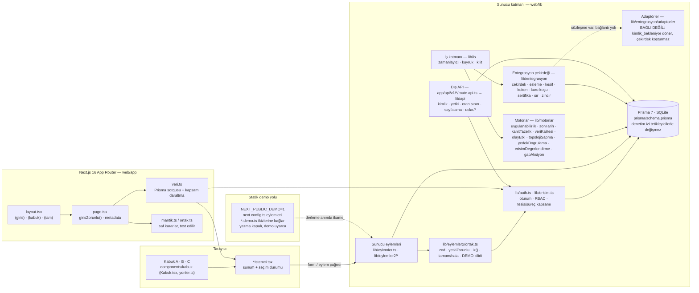

# Mimari — katman şeması

Zorlu Enerji Yönetişim Platformu'nun kod katmanları ve aralarındaki akış.
Şema depodaki güncel dizinlerden türetilmiştir; bir hedef mimari değil,
**bugünkü** yerleşimdir. Gerçek kurum sistemi, uç nokta ya da kimlik bilgisi
bu belgede yer almaz — ürün hiçbir gerçek sisteme bağlı değildir.

## Katmanlar

### Tarayıcı — kabuk ve istemci bileşenleri
`components/kabuk/Kabuk.tsx` üç ayrı kabuğu (A tezgâh · B saha · C defter)
çizer; hangi kabuğun çizileceğini **rotadan** türetir (`yonler.ts → yonSec`).
Ekranların istemci bileşenleri (`*Istemci.tsx`) yalnız sunum ve seçim durumu
taşır; iş kuralı içermez. Paylaşılan primitifler `components/kabuk/{temel,
ekran, panel, tablo, grafik, zaman, Koken, BaglamCubugu}.tsx` dosyalarında;
görsel sözleşme `web/DESIGN.md`.

### Next.js App Router — `web/app`
Her ekran aynı kalıbı izler: `page.tsx` oturumu doğrular (`girisZorunlu()`),
`veri.ts` Prisma'dan okur ve **kapsamı veri seviyesinde** daraltır
(`izinliTesisIdleri`), `mantik.ts` / `ortak.ts` saf kararları taşır ve
tarayıcısız test edilir, `*Istemci.tsx` sonucu çizer. Rota grupları
(`(giris)`, `(kabuk)/(flagship)`, `(kabuk)/(operasyonel)`, `(tam)`) URL'e
yansımaz; yalnız hangi yerleşimin sarmalayacağını belirler. Rota listesi:
[ROTA_HARITASI.md](ROTA_HARITASI.md).

### Sunucu eylemleri — `lib/eylemler.ts`, `lib/eylemler2/*`
`'use server'` modülleri. Her eylem `lib/eylemler2/ortak.ts` üzerinden aynı
kapıdan geçer: zod doğrulama → `yetkiZorunlu(modül, işlem, kapsam)` →
`iz()` denetim izi → `tamam(...)` / `hata(...)`. `DEMO` kilidi yazma
işlemlerini statik yayında durdurur. `lib/eylemler2` altındaki **her**
modülün `<ad>.demo.ts` ikizi vardır; `next.config.ts` statik derlemede gerçek
modül yerine ikizi bağlar ve eksik ikizde derleme durur.

### Kimlik ve erişim — `lib/auth.ts`, `lib/erisim.ts`
Oturum tabanlı kimlik (mutlak 12 saat, atıl 2 saat); RBAC modül × işlem
(okuma / yazma / onay) ve tesis / süreç kapsamı. Sayfa koruması
`girisZorunlu()` (oturum yoksa `/giris`), eylem koruması `yetkiZorunlu()`
(yetki yoksa hata döner). Giriş ucunda hesap ve kaynak adres başına oran
sınırı (`lib/girisKorumasi.ts`, `lib/istemciAdresi.ts`).

### Motorlar — `lib/motorlar`
Veritabanından türeyen otomasyon: uygulanabilirlik, son tarih, kanıt tazeliği,
veri kalitesi, olay → etki zinciri, topoloji sapması, yedek doğrulama, erişim
değerlendirme, gap → aksiyon. `isKosucu.ts` her koşuyu kaydeder; sonuçlar
`/saglik` ekranında izlenir.

### İş katmanı — `lib/is`
`instrumentation.ts` sunucu açılınca zamanlayıcıyı başlatır; tik dakikada
bir atar ve **ne koşacağını veritabanından türetir** (motorlar saatlik,
connector'lar kendi `pollAralikDk` değerine göre). Kuyruk ve kilit
sağlayıcıları değiştirilebilir (`kuyruk.ts`, `kilit.ts`); `ISLER_OTOMATIK=0`
ile kapatılır. Koşmayan her hedef sebebiyle raporlanır.

### Entegrasyon çekirdeği — `lib/entegrasyon`
Connector çatısı: sözleşme (`sozlesme.ts`), koşu çekirdeği (`cekirdek.ts`),
sürümlü eşleme profili (`esleme.ts`), keşif kuyruğu (`kesif.ts`), veri kökeni
(`koken.ts`, `kokenRapor.ts`), kuru koşu (`kuru.ts`), sertifikasyon harness'ı
(`sertifika.ts`), sır referansları (`sir.ts`), bağlantı sonrası zincir
(`zincir.ts`). **Adaptörler (`adaptorler/*`) bağlı değildir**: biri hariç tümü
`kimlik_bekleniyor` döndürür ve çekirdek onları koşturmaz. Sahte "başarılı
entegrasyon" üretilmez; bağlantı günü sırası
[INTEGRATION_DAY_RUNBOOK.md](../INTEGRATION_DAY_RUNBOOK.md).

### Dış API — `lib/api`
Anahtarla kimliklenen okuma/yazma uçları: `kimlik.ts` (API anahtarı),
`yetki.ts` (modül izni), `oranSinir.ts`, `sayfalama.ts`, `semalar.ts` (zod),
`uclar/*` (santraller, varlıklar, zafiyetler, yedekler, erişimler, kanıtlar,
koşular, varlık gözlemleri ve yazma). HTTP bağlama noktası `app/api/v1/*/`
altındaki `route.api.ts` dosyalarıdır; `.api.ts` adı statik demo derlemesinin
bu rotaları dışarıda bırakması içindir (`next.config.ts`). Bu dizin ürünün
**dış yüzeyidir**; ihracatları başka yerden çağrılmasa da API sözleşmesi sayılır.

### Veri — Prisma 7 + SQLite
`prisma/schema.prisma` `docs/ICERIK_MODELI.md` belgesini izler. Denetim izi
tabloları veritabanı tetikleyicileriyle UPDATE/DELETE'e kapalıdır. Mevcut
sağlayıcı SQLite'tır; farklı bir veritabanına geçiş ayrı migration, doğrulama
ve yedekleme planı gerektirir.

### Statik demo yolu
`NEXT_PUBLIC_DEMO=1` ile `next build` statik dışa aktarım üretir
(`/uyumPlatformu` kökü, `lib/demo.ts`). Yazma eylemleri demo uyarısı verir;
zaman ve rastgelelik sunucudan tek kaynakla gelir (`lib/an.ts`) ki hidrasyon
ayrışmasın. Derleme sonrası kontroller `arac/demo-yol.mjs`,
`arac/yayin-kontrol.mjs`, `arac/statik-kontrol.mjs`.

## Değişmezler

- Her yazma sunucu eyleminden geçer; istemci Prisma'ya dokunmaz.
- Kapsam ekranda değil **veride** daraltılır; kapsam dışı kayıt "yetkisiz"
  demez, hiç görünmez (`notFound()`).
- Bilinmeyen ≠ sıfır: ölçülmemiş alan `null` taşır ve ekranda "—" ya da
  "ölçülmedi" olarak yazılır.
- Bağlanmamış kaynak "canlı" gösterilmez; durum `kimlik_bekleniyor`,
  `yapılandırılmamış`, `bilinmiyor`, `hatalı` sözcükleriyle ayrışır.
